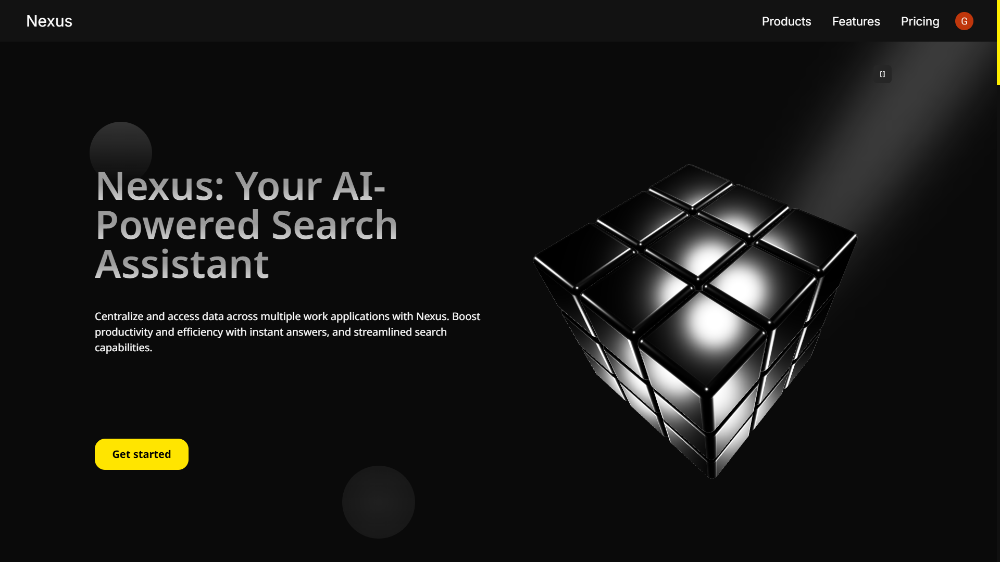
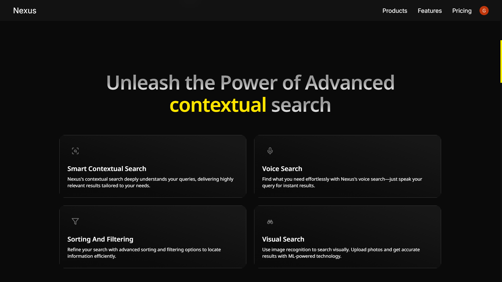
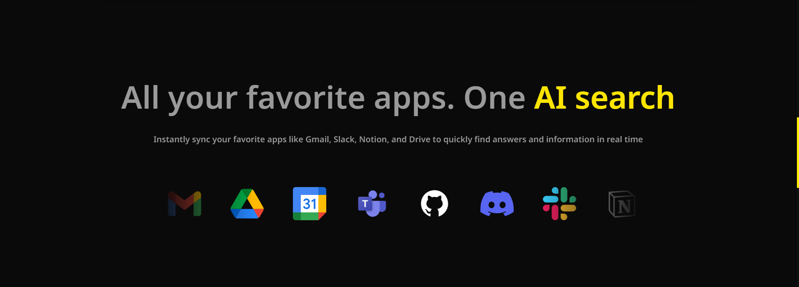
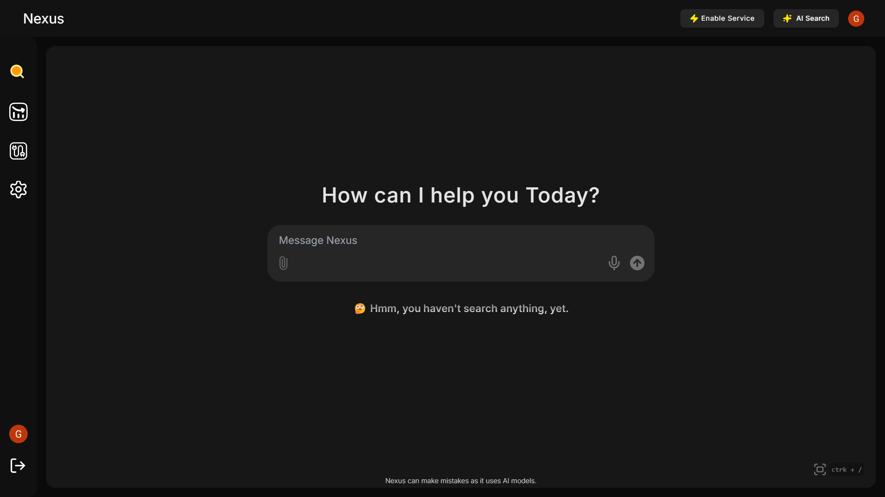
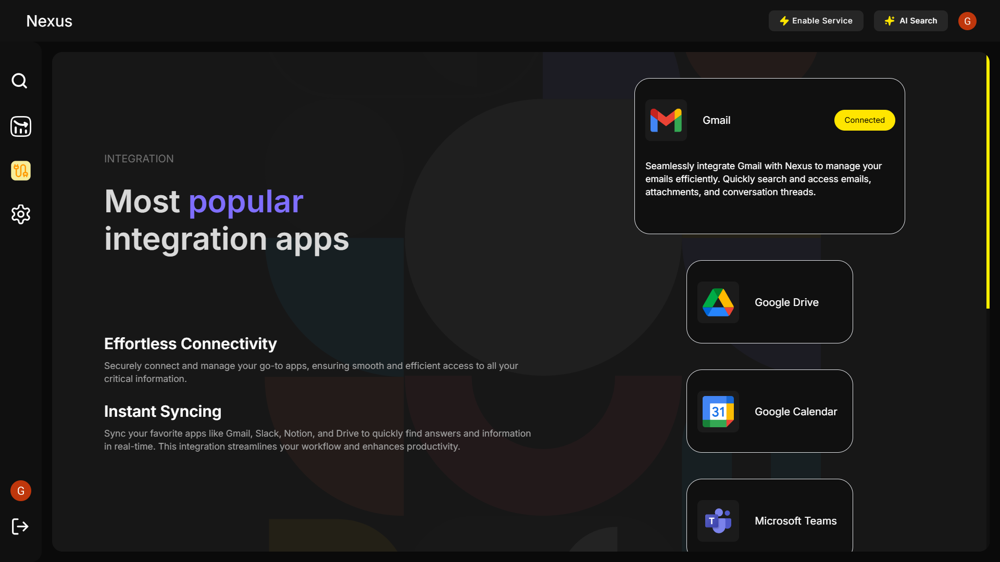
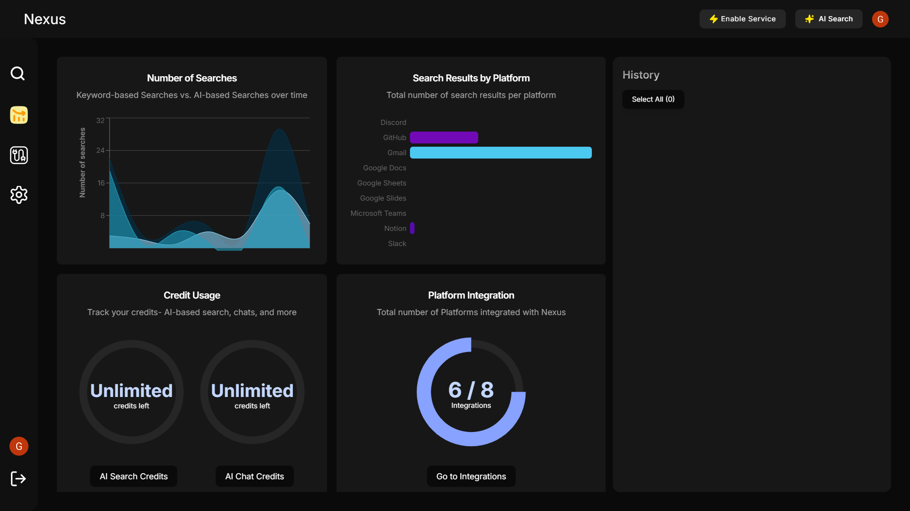

# Nexus

## Overview

Nexus is an AI-powered search assistant designed to centralize and streamline information from various work applications. By connecting popular services such as Gmail, Slack, Notion, Google Drive, and more, Nexus allows users to quickly locate and access the data they need, enhancing team productivity and efficiency.

---

## Table of Contents

1. [Features](#features)
2. [Integrated Services](#integrated-services)
3. [Privacy and Security](#privacy-and-security)
4. [Usage](#usage)
5. [Screenshots](#screenshots)
6. [FAQa](#faq)
7. [Contributing](#contributing)
8. [Installation](#installation)

---

## Features

- **Centralized Search**: Search across multiple platforms like Gmail, Google Docs, Notion, Slack, and more in real-time without storing user data.
- **Instant Answers**: Get immediate responses to work-related queries.
- **Document Interaction**: Chat/summarize with the search results.
- **Voice Search**: Search using natural voice commands.
- **Advanced Filtering**: Filter and sort search results with precision.
- **Multi-Account Integration**: Connect and manage multiple accounts for supported platforms.
- **Authentication Security**: Ensure secure access with robust authentication mechanisms.

---

## Integrated Services

Nexus supports integration with the following platforms:

- Gmail
- Google Drive (Google Docs, Google Sheets, and Google Slides)
- Google Calendar
- MS Teams
- Discord
- Github
- Notion

---

## Privacy and Security

Nexus is designed with user privacy at its core. It processes all data in real-time without storing raw user data, ensuring that sensitive information is protected. Advanced anonymization techniques prevent sensitive data from being leaked to third-party services while maintaining functionality. We use search queries provided by available Platform.

---

## Usage

1. **Connect Services**: Log in and link your preferred applications (e.g., Gmail, Slack, Google Drive).
2. **Search**: Use the search bar to enter queries and filter results using advanced options.
3. **Manage Integrations**: Add or remove accounts effortlessly.
4. **Access Insights**: View search analytics and insights to optimize productivity.

---

## Screenshots








---

## FAQs

1. How does Nexus work?

- Nexus uses AI-powered search algorithms to centralize information from various work applications. It fetches data in real-time without storing it, ensuring security and privacy.

2. What are the advanced features of Nexus?

- Nexus offers advanced features like smart contextual search, voice search, advanced filtering and sorting, personalized dashboards, multi-language support, visual search capability, authentication security, saved filter presets, and integration with Google Calendar.

3. How can I integrate Nexus with my work applications?

- Nexus supports integration with popular work applications like Gmail, Slack, Notion, and Google Drive. You can easily connect your accounts and access data from these platforms within Nexus.

4. Can I search using images in Nexus?

- Absolutely! Nexus integrates image recognition technology, allowing you to search using images and receive related documents or information.

---

## Contributing

We welcome contributions from the community! Please follow these steps to contribute:

1. Fork the repository.
2. Create a new branch for your feature or bug fix.
3. Commit your changes with clear and concise messages.
4. Submit a pull request for review.

---

## Installation

### Prerequisites

- Node.js (version 18 or higher)
- npm (or yarn)

### Steps

1. Clone the repository:

   ```bash
   git clone https://github.com/shivam0887/nexus.git
   ```

2. Navigate to the project directory:

   ```bash
   cd nexus
   ```

3. Install dependencies:

   ```bash
   pnpm install
   ```

4. Start the development server:

   ```bash
   pnpm run dev
   ```

5. Open the application in your browser at `http://localhost:3000`.

---
